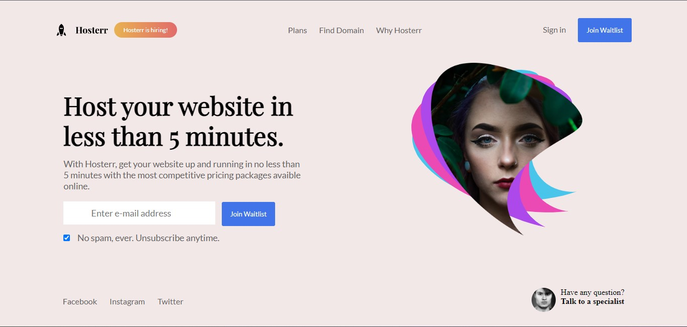

<h1 align="center"> Landing Page </h1>

Projeto desenvolvido junto ao site 
  <a href="https://www.codewell.cc/challenges">Codewell</a>&nbsp;&nbsp;&nbsp;|&nbsp;&nbsp;&nbsp;

  <a href="#-tecnologias">Tecnologias</a>&nbsp;&nbsp;&nbsp;|&nbsp;&nbsp;&nbsp;
  <a href="#-projeto">Projeto</a>&nbsp;&nbsp;&nbsp;|&nbsp;&nbsp;&nbsp;
  <a href="#memo-licença">Licença</a>

  

 

  

## 🚀 Tecnologias

Esse projeto foi desenvolvido com as seguintes tecnologias:

- HTML e CSS
- Git e Github
  

## 💻 Projeto

Projeto desenvolvido afins didáticos, onde pude apreder mais sobre html, css e fazer o uso do media query, ainda falta melhorar muito, mais me sinto realizado com esse mais esse projeto.

## :memo: Licença

Esse projeto está sob a licença MIT.

